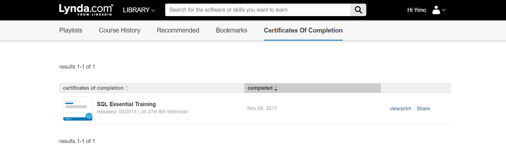
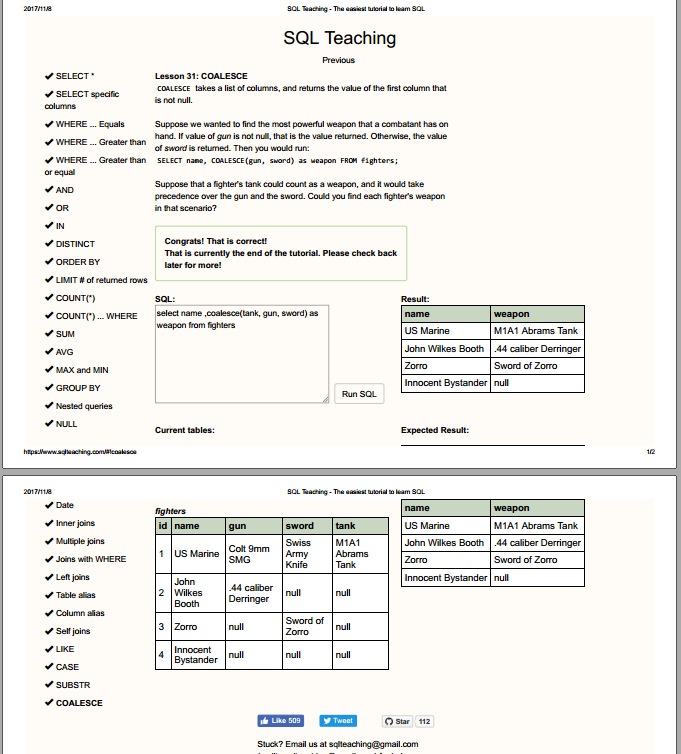

```{r setup, include=FALSE}
knitr::opts_chunk$set(echo = TRUE)
```

```{r}
library(RMySQL)
con2 <- dbConnect(MySQL(),
                 user = 'trial',
                 password = 'password',
                 host = '127.0.0.1',
                 dbname='titanic')

titanic <- read.table("/home/php2560/titanic.csv", header=TRUE, sep=",")

dbWriteTable(con2, "titanic_yzhang", titanic, overwrite = T)


```


###1. Group passengers by pclass and survived, for each group, calculate the average age.
```{r}
query <- "select pclass, survived, avg(age) as avg_age from titanic_yzhang
group by pclass, survived;"
dbGetQuery(con2, query)

```
###2.Select the passengers who survived, and group them by pclass, then calculate the average age of each group.
```{r}
query <- "select pclass, survived, avg(age) as avg_age from titanic_yzhang
   where survived=1
   group by pclass, survived;"
dbGetQuery(con2, query)


```

###3.Select the information of pclass, survived and age of passengers whose name begins with "_sen"(ignore case). ['^.' means beginning with any character; '.+' means being followed by one or more characters.]
```{r}
query <- "select name, pclass, survived, age from titanic_yzhang
where name regexp '^.sen.+';"
dbGetQuery(con2, query)

```

###4.Select name, pclass survived and age of passengers whose name contains "Jakob"(ignore case). [".*" means being followed by zero or more characters; "$" means the end of line.]
```{r}
query <-"select name, pclass, survived, age from titanic_yzhang
where name regexp 'Jakob.*$'";
dbGetQuery(con2, query)
```

###5-1.Select name, pclass survived and age of passengers whose name contains "ivar"(ignore case). [".*" means being followed by zero or more characters; "$" means the end of line.]
```{r}
query = "select name, pclass, survived, age from titanic_yzhang
   where name regexp 'Ivar.*$'";
dbGetQuery(con2, query)
```

###5-2.Select name, pclass, survived and age of passengers whose name contains "Ivar" and a comma has appeared before "ivar"(not nessarily next to each other). [',' simply means a comma; '.*' means zero or more character(s); '$' refers to the end of line.]
```{r}
query = "select name, pclass, survived, age from titanic_yzhang
   where name regexp ',.*Ivar.*$'";
dbGetQuery(con2, query)
```

###6.Group by pclass and calculate the average fare of each group.
```{r}
myQuery <- "select pclass, avg(fare) as avg_fare from titanic_yzhang
          group by pclass;"
myData <- dbGetQuery(con2, myQuery)
library(ggplot2)
ggplot(myData, aes(pclass, avg_fare)) + geom_bar(stat="identity")
```


###C-1. Create a data frame for people who did not survive
```{r}
C_query = "select pclass, sex, age, fare, survived, parch from titanic_yzhang where survived = 0;"
C_data = dbGetQuery(con2, C_query)
head(C_data)
```


###C-2.Create a graph of the average survival over the different classes. Make two distinct lines for male and female passengers.
```{r}
library(ggplot2)
library(scales)
library(dplyr)
P_query = "select pclass, sex, avg(survived) as avg_survival from titanic_yzhang 
           group by pclass, sex;"
P_data = dbGetQuery(con2, P_query)%>%
  filter(!is.na(pclass)) #remove NA

ggplot(P_data, aes(as.character(pclass), avg_survival,  group = sex, color = sex))+
  geom_line(stat="identity")+
  scale_y_continuous(labels = percent_format())+
  labs(x = "Class", y = "Average Survival")
```


###Attached:Proof of Completed SQL Lynda Course




###Attached:Screenshot to prove SQL Teaching complete



